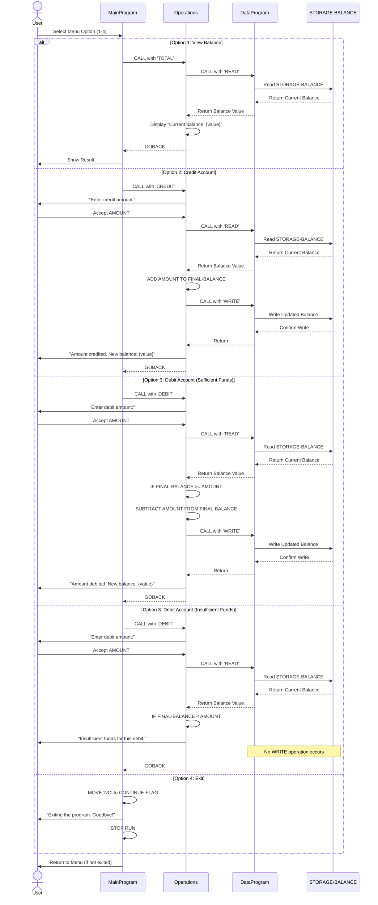

# Student Account Management System - COBOL Documentation

This documentation provides an overview of the legacy COBOL codebase for the Student Account Management System, including the purpose of each file, key functions, and business rules.

## Overview

The Student Account Management System is a menu-driven application that allows educational institutions to manage student account balances. The system supports viewing account balances, crediting accounts (deposits/credits), and debiting accounts (withdrawals/charges).

---

## COBOL Files

### 1. main.cob - Main Program
**Program ID:** `MainProgram`

**Purpose:**
Serves as the entry point and user interface for the Account Management System. Provides a menu-driven interface that allows users to interact with the system through a series of prompts.

**Key Functions:**
- Displays an interactive menu with four options
- Accepts user input (choices 1-4)
- Routes user requests to the appropriate operations module
- Handles program flow and termination

**Business Logic:**
- **Option 1 (View Balance):** Calls the Operations module to retrieve and display the current account balance
- **Option 2 (Credit Account):** Initiates a credit transaction (deposit/add funds)
- **Option 3 (Debit Account):** Initiates a debit transaction (withdrawal/charge funds)
- **Option 4 (Exit):** Terminates the program
- **Invalid Input:** Displays error message and returns to menu

**Key Working Variables:**
- `USER-CHOICE` (PIC 9): Stores user menu selection
- `CONTINUE-FLAG` (PIC X(3)): Controls the main loop (YES/NO)

---

### 2. data.cob - Data Management Module
**Program ID:** `DataProgram`

**Purpose:**
Manages persistent data storage and retrieval for the student account system. Acts as the data layer that maintains the account balance in storage and handles READ/WRITE operations.

**Key Functions:**
- Reads current balance from storage
- Writes updated balance to storage
- Maintains data consistency through controlled access

**Business Logic:**
- **READ Operation:** Retrieves the current `STORAGE-BALANCE` and passes it to the calling program
- **WRITE Operation:** Updates the `STORAGE-BALANCE` with a new value from the calling program
- All operations use the `OPERATION-TYPE` parameter to determine the action

**Key Working Variables:**
- `STORAGE-BALANCE` (PIC 9(6)V99): Persistent storage of the account balance (initial value: $1000.00)
- `OPERATION-TYPE` (PIC X(6)): Determines READ or WRITE operation
- `PASSED-OPERATION` (Linkage): Operation type passed from calling program
- `BALANCE` (Linkage): Balance value passed to/from calling program

**Business Rules:**
- Account balance uses COBOL numeric format with 6 integer digits and 2 decimal places (for currency)
- Initial account balance is set to $1000.00
- Balance is maintained across multiple operations

---

### 3. operations.cob - Business Operations Module
**Program ID:** `Operations`

**Purpose:**
Implements the core business logic for account operations. Handles balance inquiries, credit transactions, and debit transactions with validation and error handling.

**Key Functions:**
- **TOTAL (View Balance):** Retrieves and displays the current account balance
- **CREDIT:** Accepts user input for credit amount, adds it to balance, and persists the change
- **DEBIT:** Accepts user input for debit amount, validates sufficient funds, and persists the change

**Business Logic:**

#### View Balance (TOTAL)
1. Calls DataProgram to READ the current balance
2. Displays the current balance to the user

#### Credit Account (CREDIT)
1. Prompts user for credit amount
2. Reads current balance from DataProgram
3. Adds the credit amount to the balance
4. Writes the updated balance to DataProgram via DataProgram
5. Displays the new balance

#### Debit Account (DEBIT)
1. Prompts user for debit amount
2. Reads current balance from DataProgram
3. **Validates:** Checks if `FINAL-BALANCE >= AMOUNT` (Insufficient Funds Check)
4. If funds are sufficient:
   - Subtracts the debit amount from balance
   - Writes the updated balance to DataProgram
   - Displays the new balance
5. If funds are insufficient:
   - Displays "Insufficient funds for this debit."
   - Balance remains unchanged

**Key Working Variables:**
- `OPERATION-TYPE` (PIC X(6)): Type of operation (TOTAL/CREDIT/DEBIT)
- `AMOUNT` (PIC 9(6)V99): User-entered transaction amount
- `FINAL-BALANCE` (PIC 9(6)V99): Current/updated account balance (initial value: $1000.00)
- `PASSED-OPERATION` (Linkage): Operation type passed from MainProgram

---

## Business Rules for Student Accounts

1. **Minimum Balance Rule:** While an initial balance of $1000.00 is set, the system allows the balance to go to zero. No minimum balance requirement is enforced.

2. **Insufficient Funds Protection:** Debit (withdrawal) transactions are rejected if the account balance is insufficient. This prevents negative balances.

3. **No Transaction Limits:** There are no limits on the amount that can be credited or debited in a single transaction.

4. **Balance Precision:** All currency amounts are maintained with 2 decimal places for cents, using the COBOL USAGE format `9(6)V99`.

5. **Data Persistence:** Account balance changes are immediately persisted through the DataProgram module, ensuring consistency across multiple operations.

6. **Single Account Operation:** The current system manages a single account balance. Multi-student or multi-account functionality is not implemented.

---

## Program Flow Diagram

```
┌─────────────────────┐
│  MainProgram Start  │
└──────────┬──────────┘
           │
    ┌──────▼──────┐
    │  Show Menu  │
    └──────┬──────┘
           │
    ┌──────▼──────────────────┐
    │  Accept User Choice     │
    └──────┬──────────────────┘
           │
    ┌──────▼──────┐
    │  EVALUATE   │
    │   Choice    │
    └──────┬──────┘
           │
    ┌──────┴──────────────────┬──────────────────┬──────────────┐
    │                         │                  │              │
  [1]                       [2]                [3]            [4]
    │                         │                  │              │
Call Operations()      Call Operations()    Call Operations() Exit
'TOTAL '              'CREDIT'              'DEBIT '
    │                         │                  │              │
    └─────────────────────────┼──────────────────┴──────────────┘
                              │
                    ┌─────────▼─────────┐
                    │  Operations Logic │
                    │  (Calls Data Ops) │
                    └─────────┬─────────┘
                              │
                    ┌─────────▼──────────────┐
                    │  DataProgram READ/WRITE│
                    │  (Manage Balance)      │
                    └─────────┬──────────────┘
                              │
                        ┌─────▼─────┐
                        │  Continue? │
                        └─────┬─────┘
                             /
                           YES
                           /
             ┌─────────────┘
             │
        Return to Menu
```

---

## Data Flow

```
User Input
    │
    ▼
MainProgram (Menu & Routing)
    │
    ▼
Operations (Business Logic)
    │
    ├─ TOTAL: Read Current Balance
    │          │
    │          ▼
    │      DataProgram.READ
    │          │
    │          ▼ (Display Balance)
    │
    ├─ CREDIT: Add Amount to Balance
    │          │
    │          ├─ DataProgram.READ (get current)
    │          └─ DataProgram.WRITE (store updated)
    │
    └─ DEBIT: Subtract Amount from Balance
             │
             ├─ Validate Funds
             ├─ DataProgram.READ (get current)
             └─ DataProgram.WRITE (store updated if valid)
                      │
                      ▼
                    Persistent Storage
```

---

## Technical Notes

- **Language:** COBOL (legacy mainframe dialect)
- **Architecture:** Three-tier module structure (Presentation/UI, Business Logic, Data Access)
- **Inter-program Communication:** Uses CALL statements with USING parameters for data passing
- **Storage Model:** In-memory storage with simulated persistence (DataProgram acts as storage layer)
- **Error Handling:** Basic validation for debit transactions; no exception handling framework

---

## Future Modernization Considerations

- Convert to modern programming languages (Java, Python, C#)
- Implement proper database layer (SQL, document stores)
- Add comprehensive error handling and logging
- Implement security and authentication
- Support multiple concurrent user accounts
- Add transaction history and audit trails
- Implement RESTful API for integration with other systems

---

## Sequence Diagram - Data Flow

The following sequence diagram illustrates the interactions between the three COBOL modules for different operations:



**Key Observations:**

- **Read-before-Write Pattern:** Both CREDIT and DEBIT operations read the current balance before making modifications
- **Validation Before Persistence:** DEBIT operations validate funds before writing to storage
- **Immediate Persistence:** All writes to STORAGE-BALANCE are immediate; there is no transaction buffering
- **Synchronous Communication:** All CALL operations are synchronous—the calling program waits for completion before continuing
